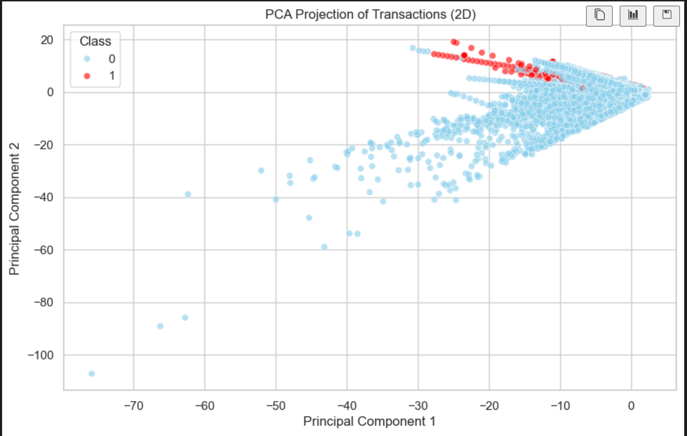
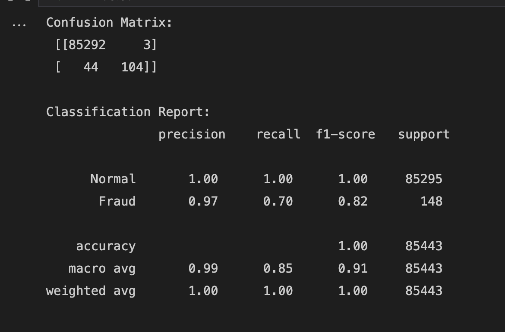

# FraudVision: Credit Card Fraud Detection with PCA + Random Forest

FraudVision is a machine learning pipeline designed to detect credit card fraud by combining unsupervised clustering, dimensionality reduction, and a supervised Random Forest classifier.

## 🌍 Overview
The goal of FraudVision is to:
- Visualize credit card transactions using PCA
- Identify patterns or clusters that suggest fraud
- Build a classifier that accurately detects fraud

Dataset used: [Kaggle Credit Card Fraud Dataset](https://www.kaggle.com/datasets/mlg-ulb/creditcardfraud)

---

## Tools & Libraries
- **Pandas, NumPy** for data handling  
- **Matplotlib, Seaborn** for plotting  
- **Scikit-learn** for PCA, KMeans, and Random Forest

---

## Key Steps

### 1. Exploratory Data Analysis (EDA)
- No missing values in the dataset
- Heavy class imbalance (fraud ~0.17%)
- Visualized transaction amount and time distributions

### 2. PCA (Principal Component Analysis)
- Applied PCA to reduce 30-dimensional data to 2D
- Visualized PCA result:

  

**Red = Fraud**, **Blue = Normal**

### 3. KMeans Clustering
- Applied unsupervised KMeans clustering (k=2)
- One cluster was fraud-heavy (~83% of frauds landed in a single cluster)
- Added cluster label as a new feature to improve classification

### 4. Random Forest Classifier
- Trained a Random Forest with class weights balanced
- Input features included: PCA-transformed components + KMeans cluster label

### 5. Model Evaluation
- Evaluated using confusion matrix & classification report:

---

## 🚀 Final Thoughts
- PCA helped visualize how fraud separates from normal
- KMeans revealed unsupervised structure that was useful for supervised learning
- Random Forest achieved high precision and good recall

This project showcases how combining unsupervised insights (like clustering) with supervised learning can create a powerful fraud detection pipeline.

---

Made with ❤️ by **Rudresh Upadhyaya**

